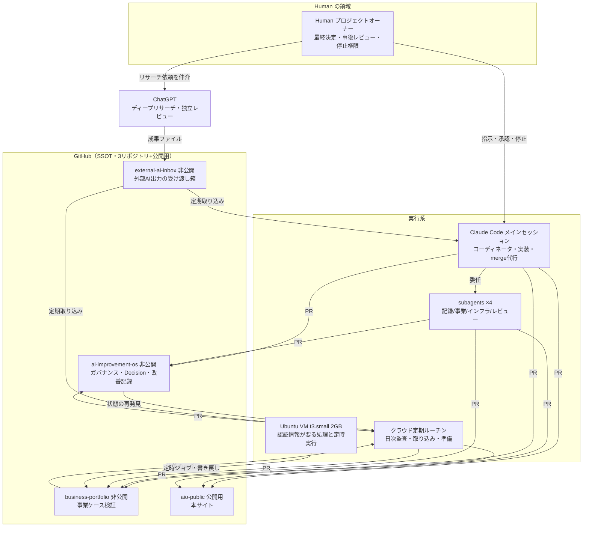

## 現在の構成（2026-07-11 時点）

※ 上図は Mermaid で図として描画されます（ソースは上記コードとして併記）。

## 各要素の責務

- **Human**: すべての権限の源泉。Decision 採択・外部公開・課金/契約の実行・停止スイッチ。AI が Human の停止意思を上書きすることはできない設計
- **Claude Code メインセッション**: Human との単一チャネル窓口。タスクを分類し、コンテキストを分離した subagent やバックグラウンドタスクへ委任。PR 作成前に 8 項目のセルフレビュー（Review Agent）を実行し、権限層の条件を満たす PR のみ merge を代行
- **subagents（4種）**: 記録系 / 事業運用系 / インフラ系 / レビュー系（read-only）。コンテキスト分離により、無関係な文脈の混入（ハルシネーションの温床）とトークン消費を抑える
- **クラウド定期ルーチン**: cron 式で起動する使い捨てセッション。**前回の記憶を持たない前提で、毎回 GitHub から状態を再発見して働く**。日次リポジトリ監査・外部 AI 出力の取り込み（6時間毎）・コンテンツ準備（日次/週次/月次）が稼働中
- **Ubuntu VM**: 常時稼働。認証情報はこの VM のローカルにだけ置き、クラウドセッションには渡さない（認証情報の局所性）。X への定時自動投稿など外部実行はここで行う。スペック（t3.small・2GB）はパイロット初期構成で、実測に応じて拡張する方針
- **ChatGPT**: 大規模リサーチと独立レビューの外部依頼先。共有リポジトリを直接触らせず、**専用インボックスリポジトリ経由の疎結合連携**（成果はファイルとして受け取り、Claude が検証してから正式リポジトリへ反映）
- **権限 3 層モデル**: Layer 1（事前承認済み・AI が自走可）/ Layer 2（外部公開など・Human の明示許可が要る）/ Layer 3（認証情報・課金・法倫理など・Human が許可しても AI は実行しない）

## 変更履歴（過去の構成から現在まで）

| 時期 | 変更 | 理由 |
|---|---|---|
| 2026-06-28 | GitHub SSOT・Human 最終決定・権限層モデルで開始 | 監査可能性と停止可能性を最初に確保 |
| 7月上旬 | **Claude 実装 × ChatGPT merge 承認の 2 エージェント体制を廃止**し、Claude 単一エージェント＋Human 事後レビューへ | 2 つの AI 間の認識不一致と往復コストが利益を上回った（[Lessons 01](../lessons/01-two-agent-retirement/)） |
| 7月上旬 | **タスクキュー自動化を停止**（停止ファイルを常置） | 自動化を急ぎすぎ、検証より先に配管を作ってしまった（[Lessons 02](../lessons/02-automation-too-fast/)） |
| 7月上旬 | 共有インデックスファイルの**並列変更を禁止し直列化** | 定期ルーチンとメイン作業の PR 競合が実際に発生（[Lessons 03](../lessons/03-shared-index-conflicts/)） |
| 7月中旬 | 外部実行をクラウドから **VM cron へ移設** | クラウドセッションから認証情報に届かないことが実証されたため。結果的に「認証情報の局所性」という良い分離になった |
| 7月中旬 | subagents 4 種と権限ガード hook を導入 | コンテキスト分離と、権限境界の機械的強制 |

## 適用ケース: X 運用パイプライン（OS を実事業検証に接続）

AIO の権限モデル・自動化・検証の仕組みを、実際の X（SNS）アカウント運用に適用しています。アーキテクチャとしての構成は次のとおりです。

- **パイプライン**: イベント情報の発掘 → コンテンツ制作（クラウド）→ **独立ファクトレビュー**（制作 AI とは別セッションの AI が公開一次情報のみで全事実を検証・合格した投稿だけが先へ進む）→ **VM cron による 1 日 1 件の自動投稿** → 人間の事後レビュー（必要なら削除）→ 計測 → 週次振り返り → 型の改善
- **安全設計**: 停止スイッチファイル・冪等性（1日1件・二重投稿防止）・月次予算ガード・検証未合格コンテンツは構造的に投稿されない
- **役割分担**: コンテンツ準備は日次/週次/月次のクラウドルーチン、画像レンダリングと投稿は認証情報を持つ VM、というクラウド/VM の分担

これは「ガバナンス付きの自動化を外部に接続するとどうなるか」の検証であり、事業としての目的・収益化の計画は本サイトの公開対象外です。

## コスト構成（実額の考え方）

- AWS EC2 t3.small 1台（従量・パイロット初期スペック。必要に応じて拡張する方針）
- Claude Pro サブスクリプション（利用枠内で運用・モデルを用途別に階層化）
- ChatGPT 有料プラン（Human が別途利用）
- 外部サービス API の従量課金（**月次上限ガードをコード側に実装**。上限到達で実行前に自動停止）

方針として、実測データなしの先行投資はせず、収益・効果の実測に連動して段階的に拡張します（詳細な資金計画は非公開）。
